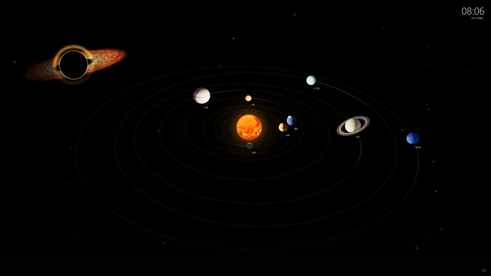

# 行星之间 · SOLAR

> 可交互的三维太阳系动态壁纸 · 完全离线 · Windows 桌面




一个单文件的三维太阳系桌面壁纸：八大行星的公转与自转、土星环、地月系统、小行星带，加上银河星野、流星与黑洞吸积盘等艺术化深空背景。行星位置由 Astronomy Engine 依真实星历计算（J2000 黄道坐标），全部贴图与运行代码内嵌在一个 HTML 文件中——无需联网、无需启动服务器。

支持 [Lively Wallpaper](https://rocksdanister.github.io/lively/) 一键导入，也兼容 Wallpaper Engine（Web 类型）。

## ✨ 特性

- 八大行星公转与自转、土星环、地月系统、小行星带
- 立体 / 俯视 / 侧视三种视角，支持拖拽旋转、滚轮缩放、点击行星查看资料
- 两种公转周期模式：**观赏**（压缩周期差异）与 **真实比例**（统一模拟时间，默认 1 秒 = 5 天）
- 行星资料卡：公转周期、自转周期、平均直径，「近距离观察」跟随行星
- 帧率 20 / 30 / 60 / 90 / 120 / 144 / 跟随屏幕，4K 原生渲染（上限 5120）
- 右上角时钟：本机时间、日期与星期
- 银河星野、流星、黑洞吸积盘可独立开关
- 完全离线：无网络请求、无音频；浏览器隐藏时自动暂停

## 🚀 快速开始

用支持 WebGL 2 的现代浏览器（建议开启硬件加速）直接打开 `solar-system.html` 即可离线预览，无需安装任何东西。

## 🖥️ 设为 Windows 动态桌面

### Lively Wallpaper（推荐）

1. 从仓库 [Release](../../releases) 下载 Lively 安装包（zip，例如 `planets-between-lively-v1.0.0.zip`）
2. 将 zip 拖进 Lively Wallpaper 窗口导入
3. 点击壁纸应用
4. 右键壁纸 →「自定义」，可调整速度、周期、帧率和各类开关

> 鼠标交互需要在 Lively 中启用「桌面鼠标输入」；建议在 Lively 中启用全屏应用 / 游戏时暂停。

### Wallpaper Engine

将 `project.json` 所在目录作为 Web 壁纸项目打开即可。

## 🎛️ 自定义选项

| 选项 | 类型 | 默认值 | 说明 |
| --- | --- | --- | --- |
| 运行速度 | 滑块 | 1×（0.25–4×） | 整体时间流速 |
| 公转周期 | 下拉 | 观赏 | 观赏：压缩周期差异；真实比例：统一模拟时间 |
| 帧率 | 下拉 | 120 | 20 / 30 / 60 / 90 / 120 / 144 / 跟随屏幕 |
| 轨道线 | 开关 | 开 | 显示轨道线 |
| 行星名称 | 开关 | 开 | 显示行星名称标签 |
| 银河星野 | 开关 | 开 | 银河背景 |
| 流星 | 开关 | 开 | 流星特效 |
| 黑洞吸积盘 | 开关 | 开 | 艺术化远景 |
| 显示时钟 | 开关 | 开 | 右上角时钟 |
| 鼠标交互 | 开关 | 关 | 关闭时鼠标不影响场景 |

## 🖱️ 交互与快捷键

- 按住左键拖动：旋转视角；滚轮：拉近推远（底部 96px 为任务栏安全区）
- 点击行星或名称：查看公转、自转、直径信息；「近距离观察」靠近并跟随
- 右下角小调节图标展开控制栏；眼睛图标或 `Esc` 隐藏
- `空格` 暂停 / 继续 · `F` 全屏 · `H` 控制栏 · `R` 恢复全景
- 帧率与公转周期直接点击按钮切换，无需下拉菜单

## 🔭 天文与比例

- 行星位置由 Astronomy Engine 计算，采用 J2000 黄道坐标，基准历元 2026-09-21 00:00 UTC
- 轨道形状与倾角来自真实星历；各轨道按固定因子缩放到适合观看的距离
- 天体大小分别放大，不代表真实大小与距离的统一比例；自转为独立的减速示意尺度
- 金星、天王星的逆向自转由轴倾角表现；月球轨道仅在选中地球时强调
- 黑洞与流星是艺术化深空背景，不参与行星动力学
- 这是用于理解运行方式的桌面作品，**不用于精密天文观测或星历预报**

## 📦 内置开源组件

| 组件 | 版本 | 许可证 |
| --- | --- | --- |
| [Three.js](https://github.com/mrdoob/three.js) | 0.181.2 | MIT |
| [Astronomy Engine](https://github.com/cosinekitty/astronomy) | 2.1.19 | MIT |
| [Lucide](https://lucide.dev) | 0.468.0 | ISC |
| [GSAP](https://gsap.com) | 3.14.2 | GSAP Standard License |
| [Solar System Scope](https://www.solarsystemscope.com/textures/) 行星贴图 | — | CC BY 4.0 |

完整许可文本见 [THIRD-PARTY.txt](THIRD-PARTY.txt)。贴图以本地内嵌方式使用、未作修改，并保留 CC BY 4.0 署名。

## 📁 项目结构

```
├── solar-system.html         # 壁纸本体（单文件，内嵌全部代码与贴图）
├── LivelyInfo.json           # Lively 壁纸元数据
├── LivelyProperties.json     # Lively 自定义选项
├── project.json              # Wallpaper Engine 项目配置
├── preview.jpg / preview.png # 预览图
├── THIRD-PARTY.txt           # 第三方组件与素材许可
├── 使用说明.txt              # 详细使用说明
├── LICENSE                   # MIT 许可证（项目自身代码）
└── README.md
```

「行星之间-Lively.zip」是构建产物，不提交进仓库，作为 GitHub Release 附件发布。

## 📜 许可证

本项目自身代码以 [MIT License](LICENSE) 开源，版权所有 © 2026 张凌康。

内置第三方组件与素材保留各自许可证；行星贴图来自 Solar System Scope（CC BY 4.0），使用时须保留署名，详见 [THIRD-PARTY.txt](THIRD-PARTY.txt)。

## 🙏 致谢

- [Solar System Scope](https://www.solarsystemscope.com/textures/) — 行星贴图
- [Astronomy Engine](https://github.com/cosinekitty/astronomy) — 行星位置计算
- [Three.js](https://threejs.org) / [GSAP](https://gsap.com) / [Lucide](https://lucide.dev) — 渲染、动画与图标
